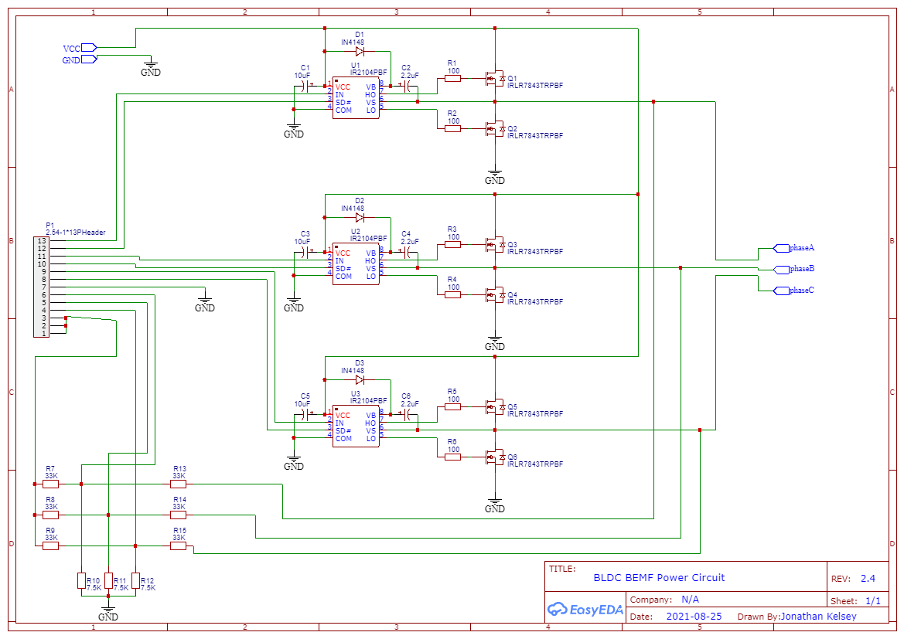
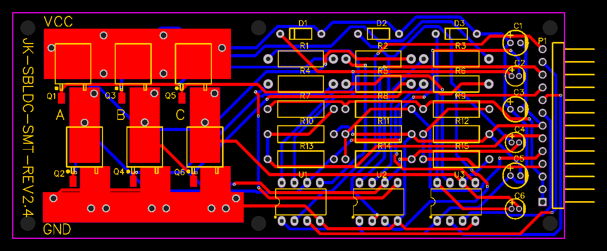

# KAEPEK-SBLDC-SMT V2.4.0

# Electrical Design

Triple Half-H-Bridge bldc driver with BEMF potential dividers (3 phases and a common virtual neutral).

This circuit was inspired greatly by the following arduino project: https://simple-circuit.com/arduino-sensorless-bldc-motor-controller-esc/
the circuit is largely the same but for some newer available transistors and a modified BEMF voltage dividing grid to offer greater protection for teensy40(which is only 3v capable) when using larger motors.

# Circuit

# PCB

The circuit has a male 13 pin header. Here is the configuration P1-x of the power circuit:

	- P1-13 (A_IN)
	- P1-12 (A_SD)
	- P1-11 (B_IN)
	- P1-10 (B_SD)
	- P1-09 (C_IN)
	- P1-08 (C_SD)
	- P1-07: TEENSY/ARD GND
	- P1-06 (Phase A voltage divider signal)
	- P1-05 (Phase B voltage divider signal)
	- P1-04 (Phase C voltage divider signal)
	- P1-03 (Virtual neutral voltage divider signal)
	- P1-02 (Virtual neutral voltage divider signal)
	- P1-01 (Virtual neutral voltage divider signal)

# Disclaimer

This is an experimental project. I have destroyed a great deal of hardware (motors, transistors, ICs) and almost caused a fire once. Please be careful when using this code. ABSOLUTELY NO WARRANTY. If you do not agree to this then please do not download this software as this would violate the license which this code was distributed with, see [./LICENSE](./LICENSE) for details.

Moreover this project lacks sensible precautions with the ESC to halt the motor when its in a faulty state (aka something is in the way of the motor spinning). Due to its prototype nature represents a threat to you, if suitable personal protective gear and precautions are not made. I recommend building some sort of protective enclosure before one could safely experiment with the setup.
